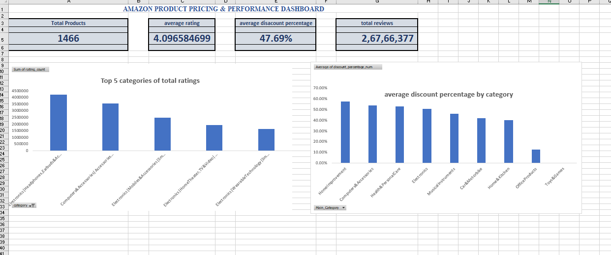

# amazon-excel-dashboard
Amazon India product pricing and MIS dashboard built in Excel
# Amazon Product Pricing & MIS Dashboard — Excel

## Overview
Analyzed 1,400+ Amazon India product listings across 9 categories 
to track pricing, discounts, and customer engagement.

## Dashboard Preview

## What I Did
- Cleaned raw data with encoding issues using Excel formulas
- Created a custom Engagement Score KPI (Rating × Review Count)
- Built a 5-sheet automated reporting pipeline
- Tracked 6 KPIs across categories using Pivot Tables

## Tools Used
Microsoft Excel — Pivot Tables, XLOOKUP, Data Validation, 
Conditional Formatting, Charts

## Key Finding
Electronics had a 54% average discount vs 12% in Office Products
